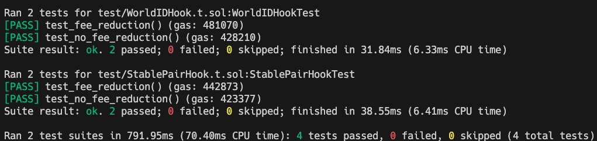

# Uni V4 Fee Hooks: StablePair and WorldID

Two Uni V4 dynamic fee hooks, for stablecoins pairs, and WorldID verification!

## Source Repos

- Uniswap V4: [https://github.com/uniswapfoundation/v4-template](https://github.com/uniswapfoundation/v4-template)
- WorldID: [https://github.com/worldcoin/world-id-onchain-template](https://github.com/worldcoin/world-id-onchain-template)

## Deployment Addresses

- `StablePairHook`: `0x70b0f2E2515DaCe5BfC0c637D2490Ad6565d9080` on WorldChain Sepolia at tx [0x276c8044839d95b689a90b5339fd095bf70697c57899e68a7e899afe495e9abe](https://worldchain-sepolia.explorer.alchemy.com/tx/0x276c8044839d95b689a90b5339fd095bf70697c57899e68a7e899afe495e9abe)
- `WorldIDHook`: `0x1ca8D3068aFa63A4e9417A8A032fd7d573AaD080` on WorldChain Sepolia at tx [0x43c98bb429535ddc86ae776bdfc42b57920cb23d8b1c4d9742d0ccd8c1bc553a](https://worldchain-sepolia.explorer.alchemy.com/tx/0x43c98bb429535ddc86ae776bdfc42b57920cb23d8b1c4d9742d0ccd8c1bc553a)

## Commands

- test: `forge test`
  

- deploy: `forge script script/<StablePairHook/WorldIDHook>.s.sol --mnemonics <menomic-path> --rpc-url <rpc-url> --broadcast`
